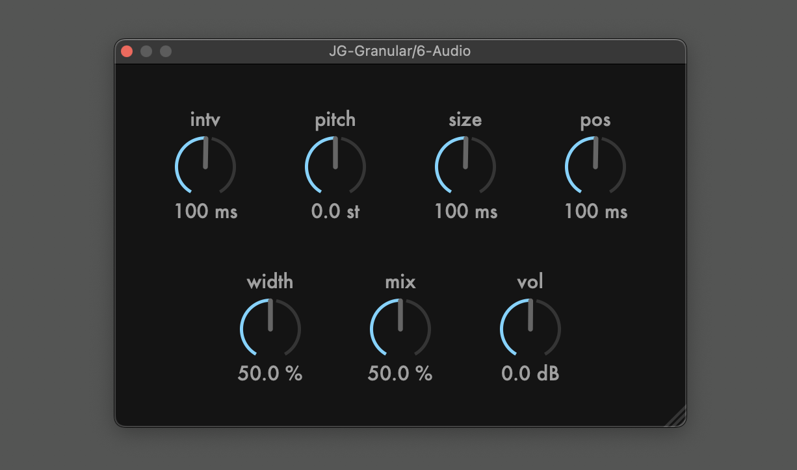

# JG-Granular
This is a streaming granular made with JUCE and gen~ c++ export. 



As this project is an example of using APVTS (juce::AudioProcessorValueTreeState) to link the exported code with juce ui, 
I will not add any new features to this plugin.

## UI Manual
- value changes: dragging or arrow keys
- fine mode: shift + dragging or shift + arrow keys
- edit mode: 0-9
- undo: [mac] cmd + z, [win] ctrl + z
- redo: [mac] cmd + shift + z, [win] ctrl + shift + z
- reset: double click

## Building

```
$ git clone https://github.com/szkkng/jg-granular.git --recursive
$ cd jg-granular
$ cmake -S . -B build -DCMAKE_BUILD_TYPE=Release
$ cmake --build build --config Release
```
